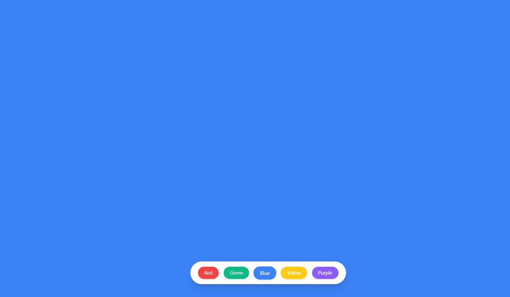
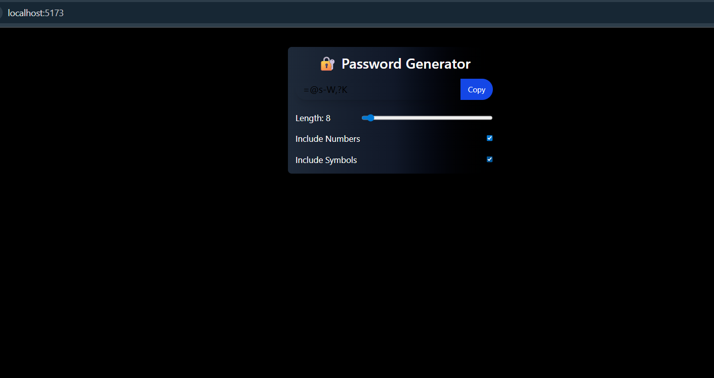

# 🚀 React Practice Log

Welcome to my hands-on journey of mastering **React.js** through daily practice, real projects, and constant refinement. Below is a day-wise log of my progress — from setting up the environment to working with JSX, Props, Hooks, and Tailwind CSS.

---

## 📅 Day 1 – 18/07/2025

✅ **What I Did:**
- Created project using **Vite**
- Cleaned up unnecessary boilerplate files
- Built a simple `App` component
- Created and imported a custom `Letsee` component
- Practiced basic **JSX syntax and structure**

💻 **Tech Stack:**
- React.js (Vite)
- JavaScript (ES6+)
- JSX

🔍 **Output:**  
A basic message rendered on screen using a clean component structure.

🌱 *Started my React journey with a 💥*

---

## 📅 Day 2 – 19/07/2025

✅ **What I Learned:**
- Difference between `JSX` and `React.createElement`
- Built multiple functional components
- Practiced creating custom elements manually
- Used `React.createElement()` to understand JSX compilation behind the scenes
- Started exploring **Hooks** (deep dive next)

🧠 *Focusing on React's building blocks, not just copying code.*

---

## 📅 Day 3 – 20/07/2025  
### 🧠 React + Tailwind + Props & Hooks Practice

✅ **Project: `tailwind_props`**

### 🔧 Folder & Component Setup:
- Created `Components/Card.jsx`
- Structured folder with correct casing (`Components/` instead of `components/`)
- Fixed import warning caused by path case sensitivity

### 🔁 Props Practice:
- Passed props like `channel`, `someobj` to `Card`
- Accessed and rendered prop values dynamically
- Practiced reusable, dynamic component patterns

### 🎨 Styling:
- Applied **Tailwind CSS** utility classes (e.g. `bg-black`, `rounded-xl`)
- Built a clean card UI layout

### 🔄 Hooks (useState):
- Used `useState` to manage a **counter**
- Added a button to increment value
- Rendered updated value on click
- Understood how **state triggers re-renders**

---

## 💡 Mini Projects Built:

### 🎨 Project: `bg_changer` – Background Color Changer  
An interactive app to change the background color randomly on button click.

✅ **What I Did:**
- Used inline style changes via `useState`  
- Stored and randomized color values  
- Strengthened understanding of event handling and dynamic styling

🛠️ **Tech:** React + Tailwind CSS + `useState`

---

### 🔐 Project: `password_generator` – Custom Password Creator  
A powerful password generator with multiple customization options.

✅ **Features:**
- Include/exclude: Uppercase, Lowercase, Numbers, Symbols  
- Adjustable password length  
- Copy-to-clipboard functionality  
- Fully responsive with **Tailwind CSS**

🛠️ **Tech:** React + Tailwind CSS + State Logic

---

## ✅ Day 3 Summary:
- Explored **props** and component-based architecture  
- Practiced **Tailwind** styling and layouts  
- Used `useState` for reactive rendering  
- Built **3 functional mini-projects**  
- Improved folder structure and code readability

---

## 🛠️ Screenshots

> All screenshots are stored in the `/screenshots` folder and displayed below:

### 🎨 bg_changer  

### 🔐 password_generator  

### 💱 currency_converter (in progress)  

## 🔮 Stay tuned...
More exciting mini-projects, deep-dives into React Hooks, Router, and Full Stack integration coming soon!

---
